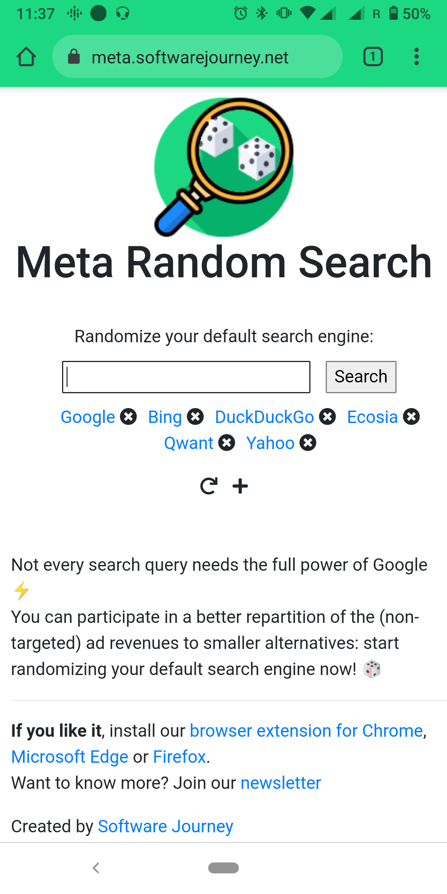

<!-- PROJECT LOGO -->
 

  

  <h3 align="center">Meta Random Search (Community version)</h3>

  

    Randomize your default search engine!
     
     
    <a href="https://meta.softwarejourney.net/">View Demo</a>
    &middot;
    <a href="https://github.com/SoftwareJourney/meta-random-search-community/issues/new?labels=bug&template=bug-report---.md">Report Bug</a>
    &middot;
    <a href="https://github.com/SoftwareJourney/meta-random-search-community/issues/new?labels=enhancement&template=feature-request---.md">Request Feature</a>
  

<!-- TABLE OF CONTENTS -->

  
Table of Contents

  <ol>
    <li>
      <a href="#about-the-project">About The Project</a>
    </li>
    <li>
      <a href="#getting-started">How is it built</a>
    </li>
    <li><a href="#usage">Usage</a></li>
    <li><a href="#roadmap">Roadmap</a></li>
    <li><a href="#contributing">Contributing</a></li>
    <li><a href="#license">License</a></li>
    <li><a href="#contact">Contact</a></li>
    <li><a href="#acknowledgments">Acknowledgments</a></li>
  </ol>

<!-- ABOUT THE PROJECT -->
## About The Project
  

The concept of Meta Random Search is simple: Randomize your default search engine!  
  
Here's why:
* This browser extension helps you to reduce your dependence on Google Search by shuffling your default engine search.
* Alternate and compare your sources of information and search tools!
* Because diversifying your information diet is as important as diversifying your food diet. 
* For many searches, DuckDuckGo feels good enough, but then sometimes it is a complete miss for a specific search. So, instead of giving up and going back to Google Search, I decided to randomize my default search engine.
* I think completely switching to an alternative search engine to Google Search is a bit unrealistic and frustrating experience. In less than 2 weeks I usually gave up.
* Search engines are the supermarkets of the information age!
I don't go to same supermarket every time, I think a healthy dose of variety is good.

Enjoy!

(<a href="#readme-top">back to top</a>)

<!-- GETTING STARTED -->
## Getting Started

Meta Random Search is mostly build with simple HTML, CSS and JavaScript files and can be self-hosted.

<!-- USAGE EXAMPLES -->
## Usage

Watch a demo: <a href="https://www.youtube.com/watch?v=31glro2nXhs">https://www.youtube.com/watch?v=31glro2nXhs</a>

Try it here: <a href="https://meta.softwarejourney.net/">https://meta.softwarejourney.net/</a>

Install our browser extension for <a href="https://chrome.google.com/webstore/detail/meta-random-search/lbjojakdjggbdpnnockgkbnbkgenfknj">Chrome</a>, <a href="https://microsoftedge.microsoft.com/addons/detail/a-random-search/gnhkmkfaccdabghfigkfjdcemmeadmcg">Microsoft Edge</a>, <a href="https://addons.mozilla.org/firefox/addon/meta-random-search/">Firefox</a>.

(<a href="#readme-top">back to top</a>)

<!-- ROADMAP -->
## Roadmap

- [ ] <a href="https://www.w3schools.com/js/tryit.asp?filename=tryjs_array_sort_random2">Implement Fisher-Yates Shuffle Algorithm</a>
- [ ] Multi-language Support
    - [ ] Spanish

See the [open issues](https://github.com/SoftwareJourney/meta-random-search-community/issues) for a full list of proposed features (and known issues).

(<a href="#readme-top">back to top</a>)

<!-- CONTRIBUTING -->
## Contributing

Contributions and spontaneous discussions about search engines are welcomed. Feel free to reach out :-)

(<a href="#readme-top">back to top</a>)

<!-- LICENSE -->
## License

Distributed under the Apache License Version 2.0. See `LICENSE` for more information.

(<a href="#readme-top">back to top</a>)

<!-- CONTACT -->
## Contact

Software Journey - [SoftyJourney](https://x.com/SoftyJourney)

Project Link: [https://github.com/SoftwareJourney/meta-random-search-community](https://github.com/SoftwareJourney/meta-random-search-community)

(<a href="#readme-top">back to top</a>)
